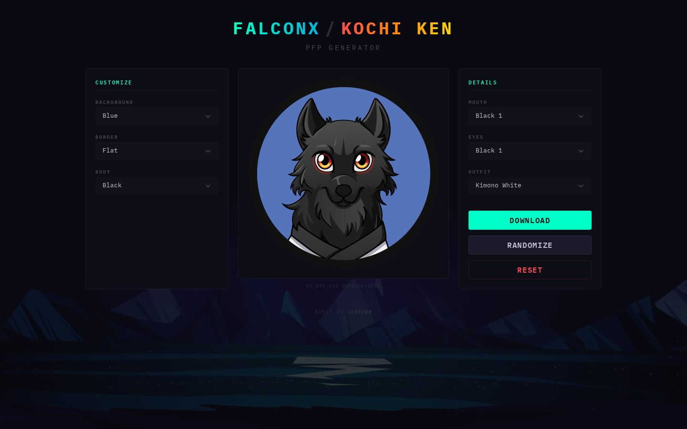

# FalconX / Kochi Ken Avatar Generator

**FalconX** was an NFT-style avatar project that later evolved into **Kochi Ken** -- a community-driven project with its own identity and aesthetic. I built this avatar generator as a tool for the community to create their own unique character avatars from a library of hand-drawn layered assets.

The generator composites six independently selectable layers onto an HTML5 canvas in real-time, producing over **55 million unique combinations**. Users can customize every detail, randomize for inspiration, and download their avatar as a PNG.

This was one of my earlier React projects -- built quickly for a community that needed it, and recently cleaned up for open-source release.



## How It Works

A **6-layer compositing system** that renders avatars in real-time:

1. **Select Layers** -- Choose from Background, Border, Body, Mouth, Eyes, and Outfit options using the dropdown controls.
2. **Live Preview** -- The HTML5 canvas composites all selected layers instantly as you make changes.
3. **Randomize** -- Hit the randomize button to generate a random combination across all layers.
4. **Download** -- Export the finished avatar as a PNG file.

## Setup

```bash
npm install
npm start
```

Opens the app at [http://localhost:3000](http://localhost:3000).

For a production build:

```bash
npm run build
```

## Architecture

```
src/
  index.js              Entry point, ChakraProvider + theme
  App.js                Root layout, background, header
  Assets/
    Images.js           Layer image URL arrays (hosted on ImgBB)
    background.jpg      App background
    title.jpg           Header banner
  Forms/
    Generator.js        Main component: canvas, dropdowns, actions
```

| Component | Tech | Description |
|-----------|------|-------------|
| `src/index.js` | React, Chakra UI | App entry point with custom dark theme |
| `src/App.js` | React, Chakra UI | Root layout with background and header |
| `src/Assets/Images.js` | JavaScript | URL arrays for all avatar layer assets |
| `src/Forms/Generator.js` | React, Canvas API | Core generator with layer compositing, controls, and export |

## License

MIT License. See [LICENSE](./LICENSE) for details.

## Author

Built by [Xipz](https://x.com/Xipzer)
